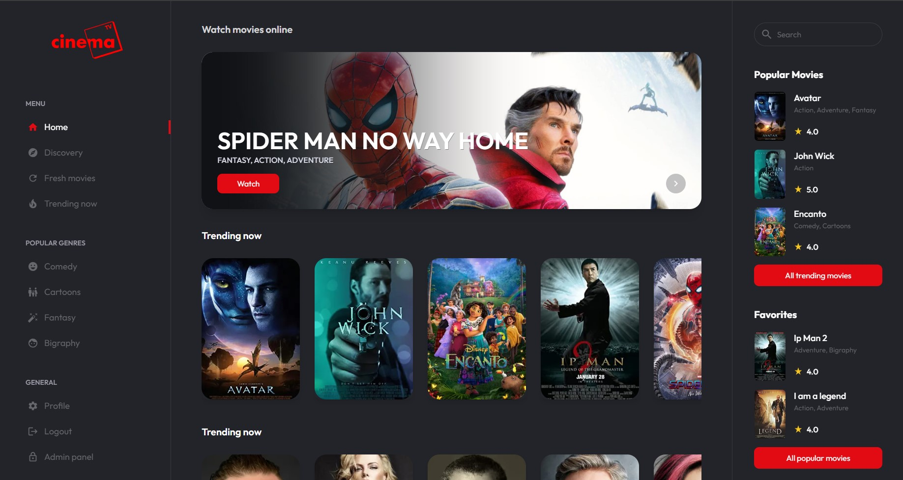
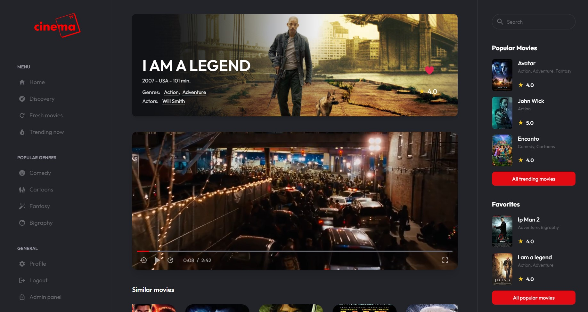
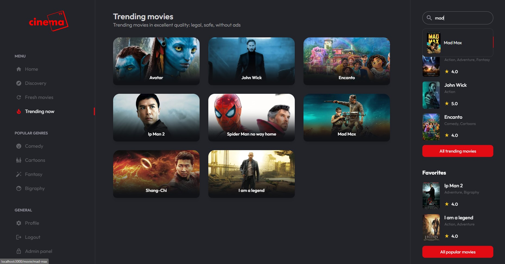
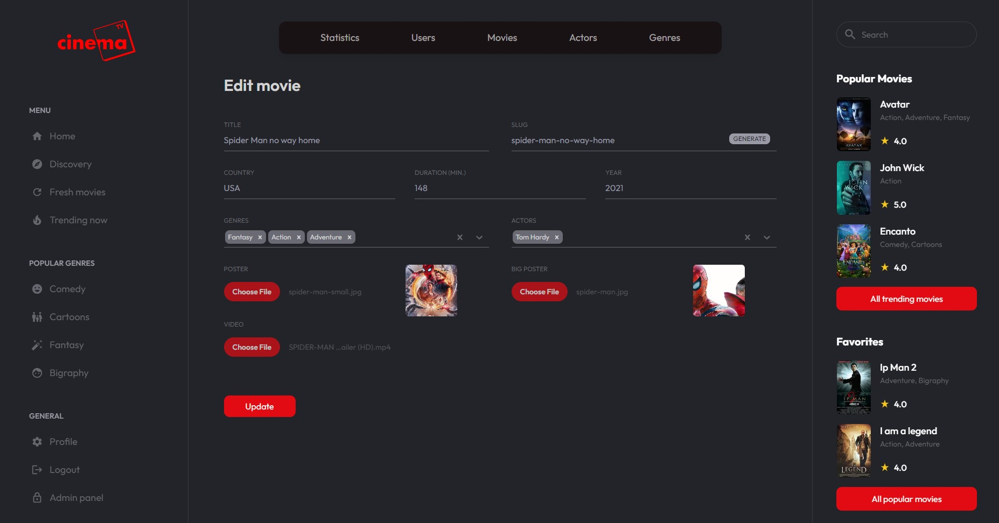

## Brief 
This is the mobile version of the project with a redesign and its own features.

## Stack
The main technologies that were used are:

> React Native ▪ Expo ▪ 

<!-- <table>
  <tr>
    <td width='300px' height='250px' align="center" valign="middle">
        
    </td>
    <td width='300px' height='250px' align="center" valign="middle">
        
    </td>
    </tr>
    <tr>
    <td width='300px' height='250px' align="center" valign="middle">
        
    </td>
    <td width='300px' height='250px' align="center" valign="middle">
        
    </td>
  </tr>
</table> -->

## Installing

```shell
git clone https://github.com/Whyssz/cinema-online.git

git checkout mobile
```

Install all dependencies, in repo's root:

```shell
yarn
```
Programs to install and configure:

- [Phone emulator](https://reactnative.dev/docs/environment-setup)
- [Debugger](https://github.com/facebook/react/tree/main/packages/react-devtools)


## Start

1. Run [backend](https://github.com/Whyssz/cinema-online/tree/backend) - `branch backend`
1. Run phone emulator
2. Run project `yarn android:dev`
